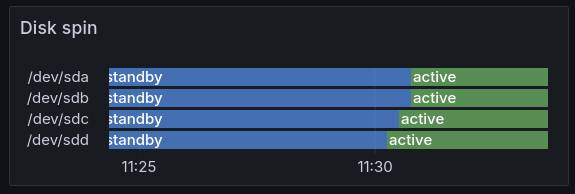

<!--
SPDX-FileCopyrightText: 2024 Agathe Porte <microjoe@microjoe.org>

SPDX-License-Identifier: GPL-3.0-only
-->

# prometheus-hdparm-exporter

prometheus-hdparm-exporter is a zero-dependency Python program that will export
the power state of the SATA disks found on the host and expose them to an HTTP
endpoint for consumption by [Prometheus](https://prometheus.io/).

It monitors if the disks are correctly shut down according to scheduled time in
the disk or manual calls to `hdparm -y`. It calls `hdparm -C` on every request
and parses the status of each SATA disk `/dev/sd*` reported by `lsblk`.
The program limits queries on SATA disks because NVME SSDs and other disk
types will often response with an `unknown` status to the `hdparm -C` command.

This way we can monitor disk spin status to be sure that the spin policy works
correctly: energy is saved and noise is reduced when not in use, and disks
do not spin up and down too often to prevent wear.



The above shows disks in a ZFS pool spinning up after trying to access the
filesystem.

## Usage

```text
prometheus-hdparm-exporter HOST PORT
```

## Example

```
$ sudo prometheus-hdparm-exporter localhost 8000 &
$ curl localhost:8000/metrics
hdparm_disk_power_status{disk="/dev/sda",status="standby"} 1 1731616722000
hdparm_disk_power_status{disk="/dev/sdb",status="standby"} 1 1731616722000
hdparm_disk_power_status{disk="/dev/sdc",status="standby"} 1 1731616722000
hdparm_disk_power_status{disk="/dev/sdd",status="active/idle"} 1 1731616722000
127.0.0.1 - - [14/Nov/2024 21:38:42] "GET /metrics HTTP/1.1" 200 236
```

The last line is the log line coming from the server’s stdout in the
background; it is not present in the HTTP response.

Status values:

- `active/idle` means the disk is spinning
- `standby` means the disk is not spinning
- `unknown` means the disk did not report anything useful

## Install

The code fits a single file `main.py` and can easily be distributed on hosts
manually:

```
curl https://raw.githubusercontent.com/gagath/prometheus-hdparm-exporter/refs/heads/main/src/prometheus_hdparm_exporter/main.py \
    -o /opt/prometheus_hdparm_exporter.py
```

If you want to install the systemd service:

```
curl https://raw.githubusercontent.com/gagath/prometheus-hdparm-exporter/refs/heads/main/systemd/prometheus-hdparm-exporter.service \
    -o /etc/systemd/system/prometheus-hdparm-exporter.service
```

If you want to install the AppArmor configuration:

```
curl https://raw.githubusercontent.com/gagath/prometheus-hdparm-exporter/refs/heads/main/apparmor.d/opt.prometheus_hdparm_exporter \
    -o /etc/apparmor.d/opt.prometheus_hdparm_exporter
```

## Grafana configuration

You will need to do a bit of transformations of the `hdparm_disk_power_status`
field in Granafa to obtain the *State timeline* output showed in the
introduction:


## Known limitations

The server will reply for any URL, not only `/metrics`. This is because this is
the only thing the server do and there is no point in parsing the query url to
match it.

The server will run `lsblk` and `hdparm -C` on every request. This may DDoS
your machine if an attacker spams the server. Always make sure to allow access
to this HTTP server only for authorized users.

## License

GPL-3.0-only.
